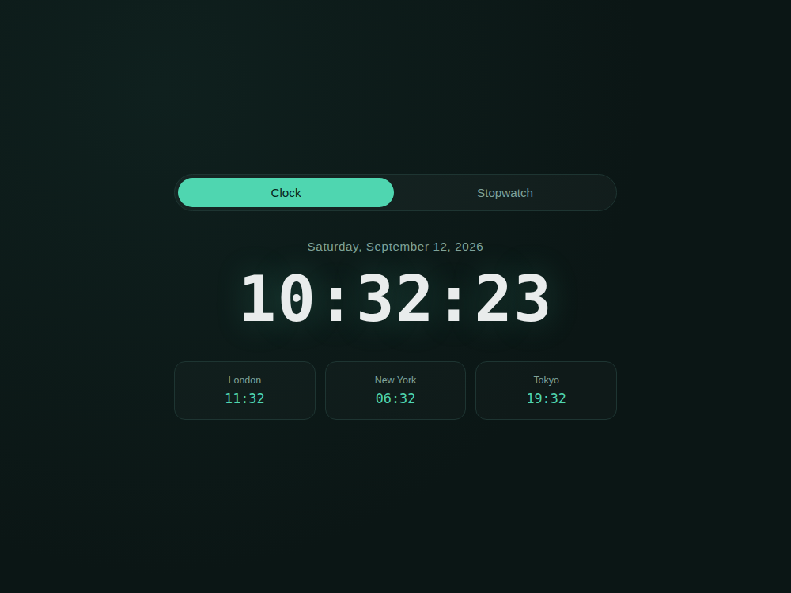
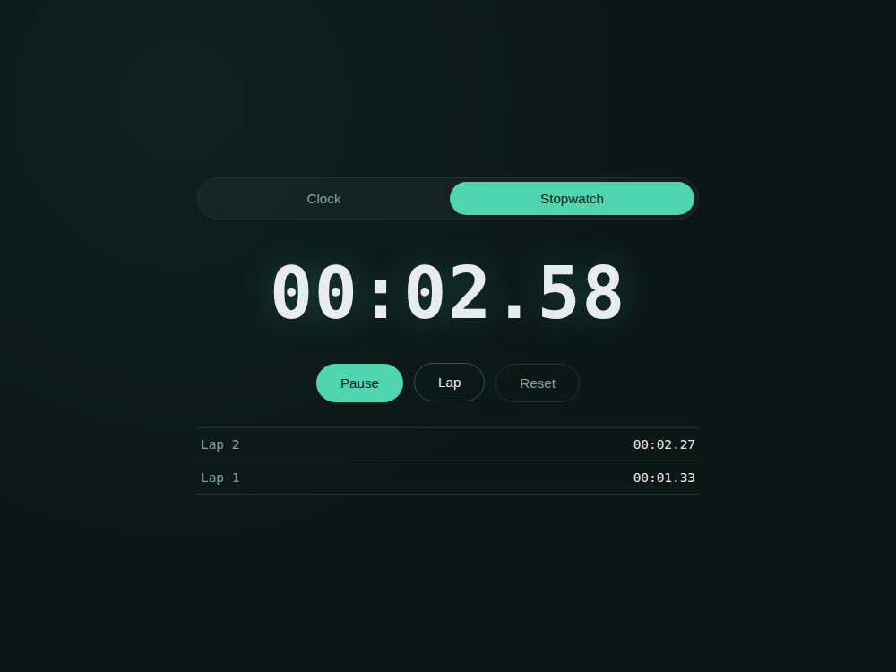

# Timekeeper — Digital Clock & Stopwatch

A simple frontend project with two tools in one page:
- A **live digital clock** showing the current time, date, and the time in three other cities (London, New York, Tokyo).
- A **stopwatch** with start/pause, lap recording, and reset.

Built with plain **HTML, CSS, and JavaScript** — no frameworks, no libraries.

## Features

- Real-time clock that updates every second
- Date display in full (weekday, month, day, year)
- Three live world-clock zones using `Intl.DateTimeFormat`
- Stopwatch with centisecond precision
- Lap recording (newest lap shown first)
- Reset button to clear the stopwatch and lap list
- Tab switcher between Clock and Stopwatch views

## Screenshots

**Clock view**



**Stopwatch view (running, with laps recorded)**



## How to run

No build step or install needed — it's plain HTML/CSS/JS.

1. Download/unzip this folder.
2. Open `index.html` directly in any modern browser (double-click it, or right-click → Open with → your browser).

That's it — the clock starts ticking immediately.

## File structure

```
01-digital-clock-stopwatch/
├── index.html      # Page structure, clock and stopwatch panels
├── style.css        # All styling (dark theme, teal accent)
├── script.js         # Clock tick logic + stopwatch/lap logic
└── screenshots/      # Preview images used in this README
```

## Notes

- The world clock times use the browser's built-in timezone database (`Intl.DateTimeFormat`), so no external API is required.
- The stopwatch uses `Date.now()` timestamps rather than counting `setInterval` ticks, so it stays accurate even if the tab is briefly backgrounded.
