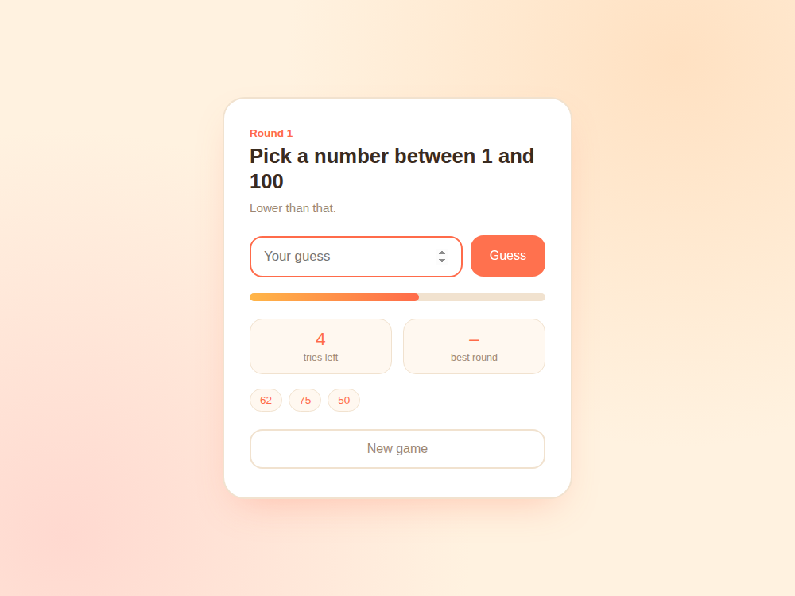

# Guess It — Number Guessing Game

A classic beginner game: the computer picks a random number between 1 and 100, and you try to guess it in 7 tries or fewer. After each guess you get a "higher" or "lower" hint.

Built with plain **HTML, CSS, and JavaScript** — no frameworks, no libraries.

## Features

- Random target number generated each round (1–100)
- 7 tries per round, shown as a countdown and a shrinking progress bar
- "Higher" / "Lower" hints after every wrong guess
- Guess history shown as chips (color-coded: too high, too low, or the win)
- Tracks your **best round** (fewest tries to win) across the session
- "New game" button to reset and play again

## Screenshot



*Shown after a few guesses — the hint, progress bar, and guess history are all live.*

## How to run

No build step or install needed — it's plain HTML/CSS/JS.

1. Download/unzip this folder.
2. Open `index.html` directly in any modern browser.
3. Type a number between 1 and 100 and hit **Guess** (or press Enter).

## File structure

```
02-number-guessing-game/
├── index.html      # Page structure, form, stats, history list
├── style.css         # All styling (warm/playful theme)
├── script.js          # Game logic: secret number, tries, hints, history
└── screenshots/       # Preview image used in this README
```

## Notes

- The game logic runs entirely client-side with `Math.random()` — no server or API needed.
- Best-round tracking resets if you refresh the page (it's stored in memory only, not saved to disk).
