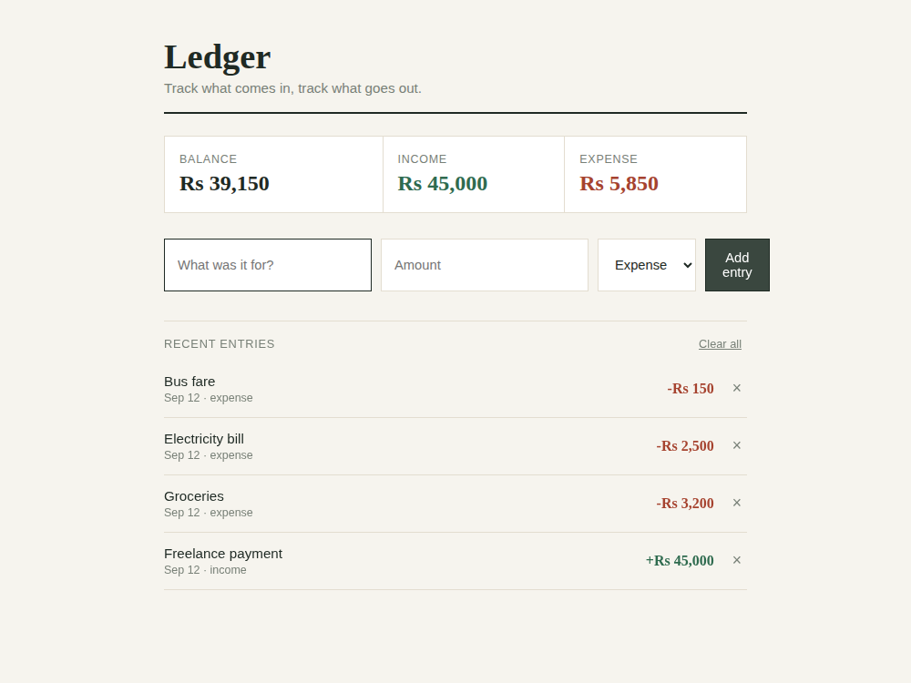

# Ledger — Daily Expense Tracker

A small, practical tool for logging day-to-day income and expenses and seeing your running balance at a glance.

Built with plain **HTML, CSS, and JavaScript** — no frameworks, no libraries.

## Features

- Add an entry with a title, amount, and type (income or expense)
- Running totals for **Balance**, **Income**, and **Expense**
- Entries list, newest first, with the date and type shown
- Remove a single entry, or clear everything at once
- Empty state message when there are no entries yet

## Screenshot



*Shown with a few sample entries — balance updates automatically as entries are added.*

## How to run

No build step or install needed — it's plain HTML/CSS/JS.

1. Download/unzip this folder.
2. Open `index.html` directly in any modern browser.
3. Fill in what the entry was for, the amount, pick Income or Expense, and click **Add entry**.

## File structure

```
03-expense-tracker/
├── index.html      # Page structure, summary cards, entry form, list
├── style.css         # All styling (editorial/ledger theme)
├── script.js          # Entry state, totals calculation, render logic
└── screenshots/       # Preview image used in this README
```

## Notes

- All data lives in memory for the current browser session — refreshing the page clears the ledger. This keeps the project dependency-free; swapping in `localStorage` or a backend would be a natural next step.
- Amounts are formatted as `Rs` (rupees) by default — change the `fmt()` function in `script.js` to use a different currency symbol.
