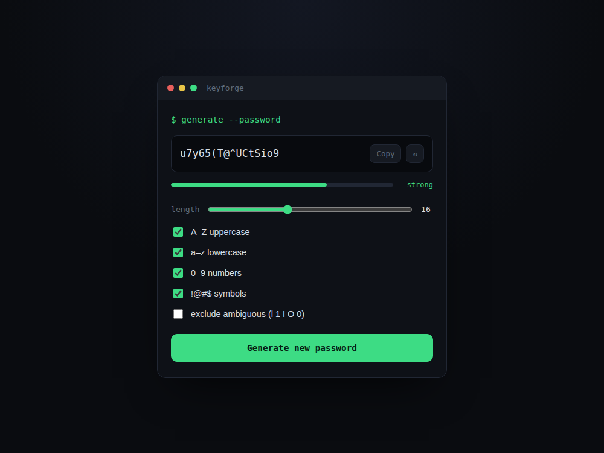

# Keyforge — Random Password Generator

A terminal-styled tool for generating strong, random passwords with configurable length and character sets.

Built with plain **HTML, CSS, and JavaScript** — no frameworks, no libraries.

## Features

- Adjustable password length (6–32 characters) via a slider
- Toggle character sets independently: uppercase, lowercase, numbers, symbols
- Option to exclude visually ambiguous characters (`l`, `1`, `I`, `O`, `0`)
- Live strength meter (weak / okay / strong) based on length and character variety
- One-click copy to clipboard
- Uses `crypto.getRandomValues()` for cryptographically secure randomness (not `Math.random()`)

## Screenshot



*A 16-character password generated with all character sets enabled, rated "strong."*

## How to run

No build step or install needed — it's plain HTML/CSS/JS.

1. Download/unzip this folder.
2. Open `index.html` directly in any modern browser.
3. Adjust the length and options as you like — the password updates automatically.
4. Click **Copy** to copy it to your clipboard.

## File structure

```
05-password-generator/
├── index.html      # Page structure, terminal-style output, options
├── style.css         # All styling (dark terminal theme)
├── script.js          # Secure random generation, strength scoring, copy logic
└── screenshots/       # Preview image used in this README
```

## Notes

- Passwords are generated using `window.crypto.getRandomValues()` rather than `Math.random()`, since `Math.random()` is not cryptographically secure and shouldn't be used for anything security-related.
- Nothing is sent anywhere or stored — every password exists only in the browser tab until you copy or regenerate.
