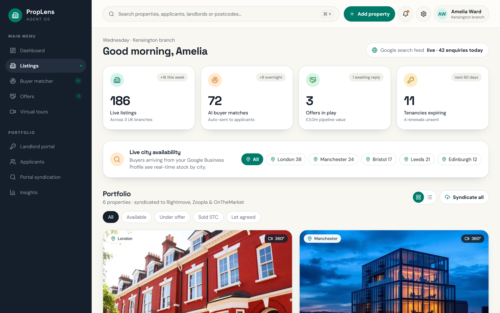
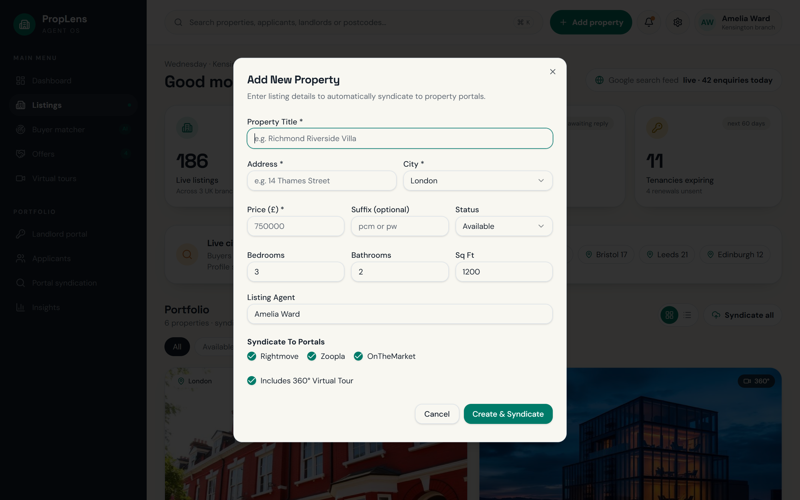
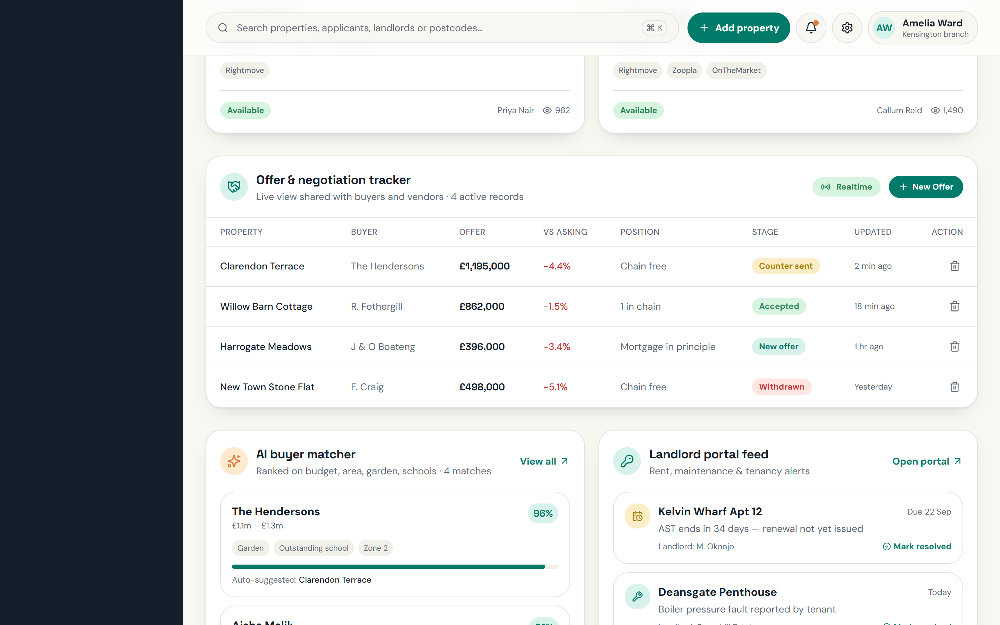
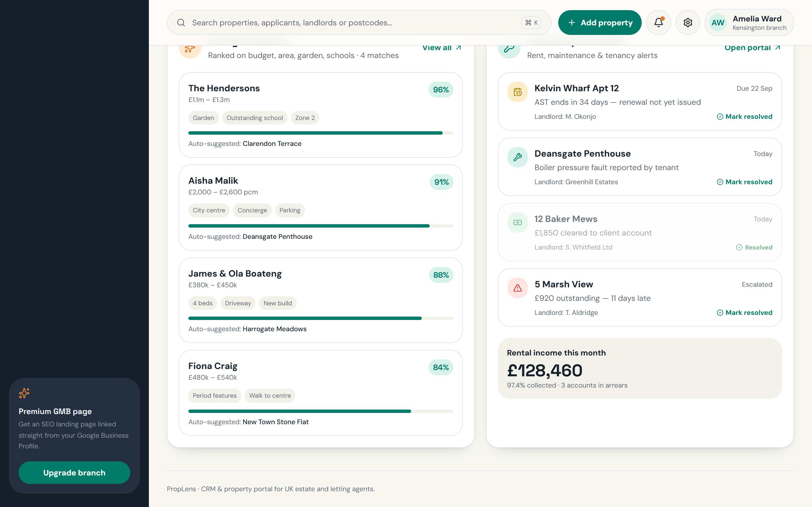

# PropLens — CRM & Property Portal for UK Estate Agents

PropLens is a modern, full-stack CRM and property management platform designed for UK estate and letting agents. It automates listing syndication to **Rightmove**, **Zoopla**, and **OnTheMarket**, matches buyers with AI preference scoring, tracks real-time offer negotiations, and gives landlords a live portal feed for rent, tenancies, and maintenance.

---

## 📸 Application Screenshots (Live App)

### 1. Dashboard Overview & Portfolio Analytics
Main dashboard featuring live KPI counters (Live listings, AI buyer matches, Offers in play with pipeline value in £m, and Expiring tenancies), interactive city availability filters, and the portfolio property grid.



---

### 2. Add New Property & Portal Syndication Modal
Interactive modal to list new properties with instant Zod validation, pricing, city, room counts, agent assignment, and multi-portal syndication toggles.



---

### 3. Real-Time Offer & Negotiation Tracker
Live negotiation table calculating percentage differences vs asking prices, buyer chain position, and interactive dropdowns to transition offer stages (`New offer`, `Counter sent`, `Accepted`, `Withdrawn`).



---

### 4. AI Buyer Matcher & Landlord Portal Feed
AI matching engine scoring buyer preferences and budget against available properties, alongside live landlord alerts with one-click resolution and monthly rent collection analytics.



---

## 🏗️ Architecture & Tech Stack

### Frontend
- **Framework**: React 19 + TypeScript
- **Routing**: TanStack Router (File-based Routing)
- **Data Fetching & State**: TanStack React Query v5
- **Styling**: Tailwind CSS v4 + Space Grotesk / DM Sans typography
- **UI Components**: Radix UI primitives / Shadcn UI + Sonner Notifications
- **Icons**: Lucide React

### Backend
- **Server Framework**: TanStack Start + Nitro SSR
- **Server Functions**: Isomorphic `createServerFn` RPC endpoints (`src/lib/server-fns.ts`)
- **Database & Data Store**: In-Memory Singleton Database (`src/server/db.ts`)
- **Services Layer**:
  - `PropertiesService` — CRUD, filtering, search, and portal syndication
  - `OffersService` — Buyer bids, pipeline valuation, and stage transitions
  - `BuyerMatcherService` — AI preference scoring algorithm
  - `LandlordService` — Tenancy expiry, maintenance, arrears, and alert resolution
  - `StatsService` — Real-time analytics aggregation

---

## 📁 Project Structure

```
proplens/
├── docs/
│   └── screenshots/              # High-resolution screenshots of the running app
│       ├── dashboard.png
│       ├── add-property-modal.png
│       ├── offer-tracker.png
│       ├── ai-matcher-landlords.png
│       └── full-page.png
├── src/
│   ├── assets/                   # Property images & static assets
│   ├── components/
│   │   ├── proplens/             # PropLens application feature components
│   │   │   ├── AddOfferDialog.tsx
│   │   │   ├── AddPropertyDialog.tsx
│   │   │   ├── InsightPanels.tsx
│   │   │   ├── OfferTracker.tsx
│   │   │   ├── PropertyGrid.tsx
│   │   │   ├── Sidebar.tsx
│   │   │   ├── StatCards.tsx
│   │   │   └── Topbar.tsx
│   │   └── ui/                   # Reusable UI component library (shadcn/ui)
│   ├── lib/
│   │   ├── server-fns.ts         # TanStack Start Server Functions RPC
│   │   └── utils.ts
│   ├── routes/
│   │   ├── __root.tsx            # App root layout, QueryClientProvider & Toaster
│   │   └── index.tsx             # Dashboard route with search & city filters
│   ├── server/                   # Backend services and data layer
│   │   ├── db.ts                 # Database singleton with initial datasets
│   │   └── services/
│   │       ├── buyers.service.ts
│   │       ├── landlords.service.ts
│   │       ├── offers.service.ts
│   │       ├── properties.service.ts
│   │       └── stats.service.ts
│   ├── server.ts                 # Server entry point
│   ├── start.ts                  # TanStack Start configuration
│   └── styles.css                # Global Tailwind CSS styles
├── package.json
└── vite.config.ts
```

---

## 🚀 Getting Started

### 1. Clone & Install Dependencies
```bash
git clone https://github.com/Tahreem04-ops/proplens.git
cd proplens
npm install
```

### 2. Run Development Server
```bash
npm run dev
```
Open [http://localhost:8080](http://localhost:8080) in your browser.

### 3. Build for Production
```bash
npm run build
npm run preview
```

---

## ⚡ Features Summary

- ✅ **Real-Time Property Portfolio**: Filter by status (`Available`, `Under offer`, `Sold STC`, `Let agreed`) and city.
- ✅ **One-Click Portal Syndication**: Syndicate listings directly to Rightmove, Zoopla, and OnTheMarket with toast notifications.
- ✅ **Live Search**: Instant keyword search for properties, agents, postcodes, and applicants.
- ✅ **Offer Management**: Add new offers, track variance against asking price, and update stages directly from the table.
- ✅ **AI Match Score**: Auto-suggests properties to buyers based on requirements and budget criteria.
- ✅ **Landlord & Tenancy Alerts**: Manage arrears, maintenance issues, and mark alerts as resolved in real-time.
