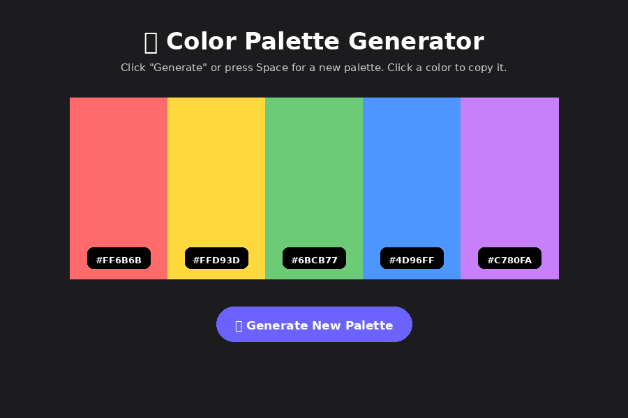

# 🎨 Color Palette Generator

A quick and easy React app that generates random 5-color palettes — great for designers, developers, or anyone needing color inspiration.

## 📸 Screenshot



## ✨ Features

- Generates a random 5-color palette on load
- Click **Generate New Palette** button (or press **Space**) for a new set
- Click any color block to copy its HEX code to clipboard
- Shows "Copied!" feedback briefly after copying
- Hover effect expands a color block slightly

## 🛠️ Tech Stack

- React (Create React App)
- Plain CSS (flexbox layout + transitions)

## 📂 Project Structure

```
color-palette-generator/
├── public/
│   └── index.html
├── src/
│   ├── App.js
│   ├── App.css
│   └── index.js
├── package.json
└── README.md
```

## 🚀 How to Run

1. Install dependencies:
   ```bash
   npm install
   ```
2. Start the development server:
   ```bash
   npm start
   ```
3. Open [http://localhost:3000](http://localhost:3000) in your browser.

## 💡 How It Works

- `randomHex()` generates a random hex color using `Math.random()` and converts it to a 6-digit hex string.
- `generatePalette()` creates an array of 5 random colors, stored in state.
- Clicking a color block uses the `navigator.clipboard.writeText()` API to copy the hex code.
- A `keydown` event listener triggers a new palette when the Space key is pressed.

## 🔮 Possible Improvements

- Lock individual colors while regenerating others
- Export palette as an image or CSS variables file
- Add color harmony modes (complementary, analogous, etc.)
