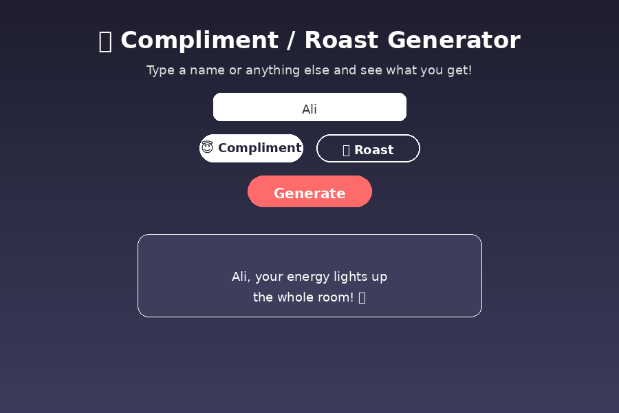

# 🎭 Compliment / Roast Generator

A fun, unique React mini-app that generates a random compliment or a light-hearted roast based on the name/thing you type.

## 📸 Screenshot



## ✨ Features

- Type any name or word (e.g. "Ali", "Monday", "Code")
- Toggle between **Compliment 😇** and **Roast 🔥** modes
- Random message generated on every click
- Smooth fade/slide-in animation for the result
- Simple validation (asks for input if empty)

## 🛠️ Tech Stack

- React (Create React App)
- Plain CSS (gradient background + animations)

## 📂 Project Structure

```
compliment-roast-generator/
├── public/
│   └── index.html
├── src/
│   ├── App.js
│   ├── App.css
│   └── index.js
├── package.json
└── README.md
```

## 🚀 How to Run

1. Install dependencies:
   ```bash
   npm install
   ```
2. Start the development server:
   ```bash
   npm start
   ```
3. Open [http://localhost:3000](http://localhost:3000) in your browser.

## 💡 How It Works

- Two arrays (`compliments` and `roasts`) hold template strings with a `{name}` placeholder.
- On clicking **Generate**, a random string is picked using `Math.random()` and the placeholder is replaced with the typed name.
- `mode` state (compliment/roast) decides which array is used.

## 🔮 Possible Improvements

- Add more compliments/roasts
- Add a "Copy to clipboard" / "Share" button
- Add sound effects on generate
