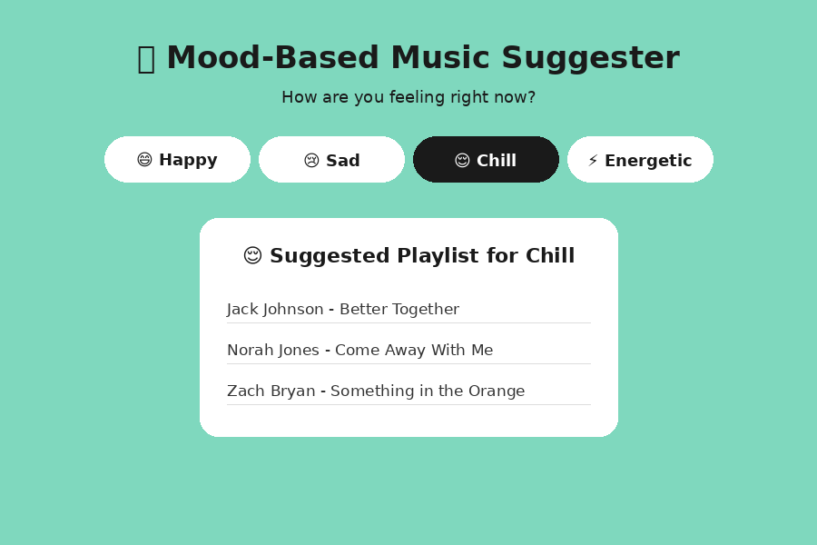

# 🎵 Mood-Based Music Suggester

A simple and unique React app that suggests a mini playlist based on the user's current mood.

## 📸 Screenshot



## ✨ Features

- 4 mood options: Happy, Sad, Chill, Energetic
- Background color changes dynamically with selected mood
- Instant playlist suggestion (no backend / API needed)
- Smooth fade-in animation for the playlist card
- Fully responsive, clean UI

## 🛠️ Tech Stack

- React (Create React App)
- Plain CSS (no external UI library)

## 📂 Project Structure

```
mood-music-suggester/
├── public/
│   └── index.html
├── src/
│   ├── App.js
│   ├── App.css
│   └── index.js
├── package.json
└── README.md
```

## 🚀 How to Run

1. Install dependencies:
   ```bash
   npm install
   ```
2. Start the development server:
   ```bash
   npm start
   ```
3. Open [http://localhost:3000](http://localhost:3000) in your browser.

## 💡 How It Works

- `moods` object stores emoji, background color, and a list of songs for each mood.
- Clicking a mood button updates `selectedMood` state via `useState`.
- The app conditionally renders the matching playlist card.

## 🔮 Possible Improvements

- Connect to Spotify API for real playlists
- Add more moods
- Save last selected mood in localStorage
