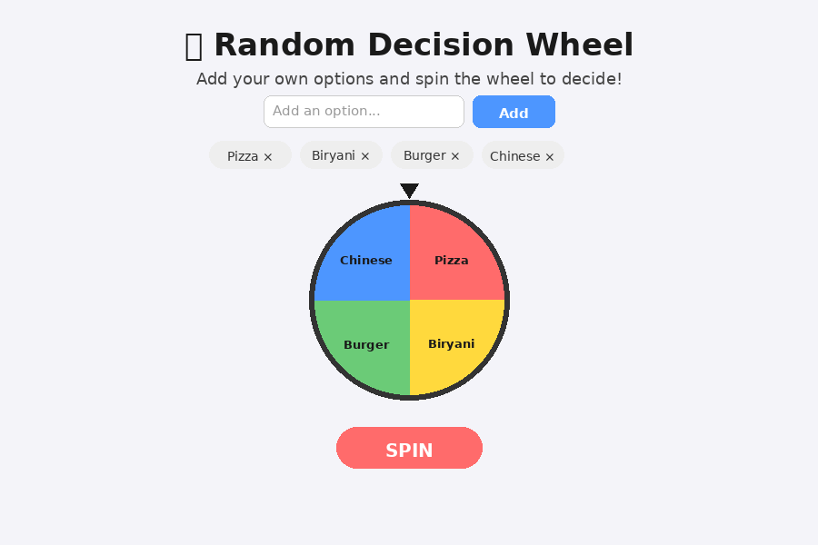

# 🎡 Random Decision Wheel

A colorful, unique React app that helps you make quick decisions by spinning a customizable wheel of your own options.

## 📸 Screenshot



## ✨ Features

- Add/remove your own custom options (e.g. "Pizza", "Biryani", "Burger")
- Colorful spinning wheel built with CSS `conic-gradient`
- Smooth spin animation with realistic deceleration
- Randomly selects and displays the winning option
- Spin button disabled while spinning or with less than 2 options

## 🛠️ Tech Stack

- React (Create React App)
- Plain CSS (conic-gradient wheel + CSS transitions)

## 📂 Project Structure

```
random-decision-wheel/
├── public/
│   └── index.html
├── src/
│   ├── App.js
│   ├── App.css
│   └── index.js
├── package.json
└── README.md
```

## 🚀 How to Run

1. Install dependencies:
   ```bash
   npm install
   ```
2. Start the development server:
   ```bash
   npm start
   ```
3. Open [http://localhost:3000](http://localhost:3000) in your browser.

## 💡 How It Works

- `options` array (state) holds the list of choices, editable via an input field.
- The wheel's segments are drawn using a dynamically generated `conic-gradient` CSS background, split evenly by number of options.
- On **Spin**, a random winning index is picked, and the wheel is rotated (`extraSpins + calculated offset`) so the pointer lands on that segment after a 4s animation.
- The winner is displayed once the animation completes.

## 🔮 Possible Improvements

- Save option lists in localStorage
- Add sound effect when the wheel stops
- Add confetti animation on result
