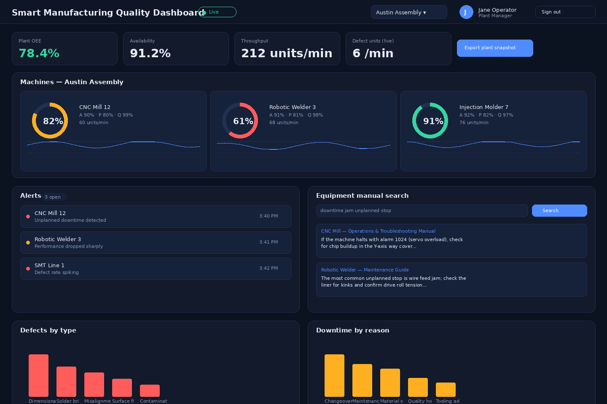

# Smart Manufacturing Quality Dashboard

A React dashboard for a multi-plant manufacturing operation. It consumes a **simulated real-time production/inspection data feed** and surfaces OEE, defects, downtime, and alerts — with AI-generated anomaly explanations grounded in a retrieval layer over equipment manuals, role-based plant access, streaming charts, alert acknowledgement, CSV/JSON export, caching, and resilient API handling (retry, backoff, circuit breaker, offline fallback).



> The screenshot above is a to-scale mockup of the live UI (generated offline for this README) — the real app looks and behaves the same, but with continuously updating live data.

## Features

- **Real-time simulated data feed** — `LiveFeed` (in `src/data/simulator.js`) mimics a WebSocket/MQTT bridge: it streams production ticks and inspection results for every machine across 3 plants, occasionally injects anomalies (OEE drops, defect spikes, downtime, quality drops), and randomly simulates dropped connections that auto-reconnect.
- **OEE, defects, downtime, alerts** — per-machine OEE gauges, plant-level KPI cards, streaming line charts, defect/downtime breakdown bar charts, and a live alert feed, all built with dependency-free custom SVG chart components.
- **AI explanations for anomalies** — clicking an alert opens a panel that generates a plain-language explanation: probable cause, severity rationale, and a recommended first action, grounded in the most relevant equipment-manual passage (a small local RAG pipeline).
- **Retrieval over equipment manuals** — a TF-IDF-style keyword retrieval service (`src/services/retrieval.js`) indexes a local manuals corpus (`src/data/manuals.js`) and powers both the AI explanation panel and a standalone manual search UI.
- **Role-based plants** — Administrator / Plant Manager / Quality Engineer / Operator roles gate which plants are visible and whether a user can acknowledge alerts or export data (`src/context/AuthContext.jsx`).
- **Streaming charts** — per-machine OEE trend lines redraw continuously as new ticks arrive, with a rolling in-memory window.
- **Alert acknowledgement** — acknowledge from the list or the detail modal; acknowledgement persists across reloads via cached state.
- **Exports** — CSV export for alerts/defects/downtime tables, JSON export for a full plant snapshot.
- **Caching** — a TTL-based `localStorage` cache (`src/services/cache.js`) caches AI explanations, manual search results, the user session, and acknowledged-alert IDs, and doubles as the offline fallback for the resilient API layer.
- **Resilient API handling** — `src/services/api.js` wraps every simulated network call (AI explain, manual retrieval) with a request timeout, exponential backoff + jitter retries, a per-endpoint circuit breaker, and automatic fallback to the last cached response when the "service" is unavailable. The simulated backend fails ~12–18% of calls at random specifically to exercise this path.

## Architecture

```
src/
  data/
    simulator.js      # LiveFeed: simulated streaming production/inspection data + plants/machines
    manuals.js         # Local equipment-manual corpus (chunked for retrieval)
  services/
    api.js              # Resilient request wrapper: timeout, retry+backoff, circuit breaker
    cache.js             # TTL localStorage cache
    retrieval.js       # TF-IDF-style search over manuals.js, routed through api.js
    aiExplain.js       # RAG-style anomaly explanation generator, routed through api.js
    export.js           # CSV/JSON client-side export helpers
  context/
    AuthContext.jsx    # Role-based session/permissions/plant scoping
  hooks/
    useLiveData.js      # Subscribes to LiveFeed, maintains rolling buffers + alert/defect/downtime logs
  components/
    LoginScreen, Header, Dashboard, MachineGrid, OEEGauge,
    LineChart, BarChart, AlertsPanel, AlertDetailModal,
    AnomalyExplanation, ManualSearch, DefectsPanel, DowntimePanel,
    KPICard, ErrorBoundary
```

**Data flow:** `LiveFeed` generates ticks → `useLiveData` buffers them into per-machine history, a defect log, a downtime log, and an alert list → `Dashboard` scopes that data to the signed-in user's assigned plant(s) → panels render it, with `AlertsPanel`/`AnomalyExplanation` calling the resilient `aiExplain`/`retrieval` services on demand.

**Swapping in a real backend:** `simulateCall` in `src/services/api.js` is the only place that "talks to the network." Replace its body with a real `fetch(...)`/WebSocket call and every consumer (retrieval, AI explanation, and — if you wire `LiveFeed` to a real socket — the live data hook) keeps working unchanged, since the resilience layer (timeout/retry/circuit breaker/cache) sits above it.

## Getting started

Requires Node.js 18+.

```bash
npm install
npm run dev
```

Then open the printed local URL (default `http://localhost:5173`). Sign in with any name, pick a role, and (for non-Administrator roles) a plant.

```bash
npm run build     # production build to dist/
npm run preview   # preview the production build locally
```

## Roles

| Role | Plant visibility | Acknowledge alerts | Export |
|---|---|---|---|
| Administrator | All plants | ✅ | ✅ |
| Plant Manager | Assigned plant only | ✅ | ✅ |
| Quality Engineer | Assigned plant only | ✅ | ✅ |
| Operator | Assigned plant only | ❌ (read-only) | ❌ |

## Notes on the simulation

- No backend or external API keys are required — everything runs client-side.
- The "AI explanation" step is a deterministic template engine grounded in retrieved manual text, not a live LLM call, but it's wired through the same resilient request path a real model call would use (see `src/services/aiExplain.js`), so pointing it at a real API is a small, contained change.
- Simulated failures (~12–18% per call) and occasional feed reconnects are intentional — they're what exercise the retry/backoff/circuit-breaker/cache-fallback logic instead of leaving it decorative.

## Tech stack

React 18, Vite. No charting or state-management libraries — charts are custom SVG components and state is plain React hooks/context, to keep the project dependency-light and easy to read end-to-end.
