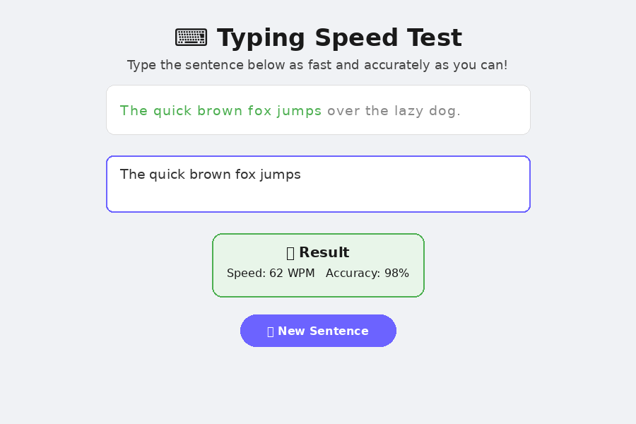

# ⌨️ Typing Speed Test

A simple, unique React app that measures your typing speed (WPM) and accuracy against a random sentence.

## 📸 Screenshot



## ✨ Features

- Random target sentence picked on each attempt
- Live character-by-character color feedback (green = correct, red = wrong) as you type
- Calculates **Words Per Minute (WPM)** once you finish typing the full sentence correctly
- Calculates typing **accuracy percentage**
- "New Sentence" button to restart with a fresh sentence

## 🛠️ Tech Stack

- React (Create React App)
- Plain CSS (monospace typography for a code-editor feel)

## 📂 Project Structure

```
typing-speed-test/
├── public/
│   └── index.html
├── src/
│   ├── App.js
│   ├── App.css
│   └── index.js
├── package.json
└── README.md
```

## 🚀 How to Run

1. Install dependencies:
   ```bash
   npm install
   ```
2. Start the development server:
   ```bash
   npm start
   ```
3. Open [http://localhost:3000](http://localhost:3000) in your browser.

## 💡 How It Works

- A `sentences` array holds a few target sentences; one is picked randomly on load/restart.
- A timer starts (`Date.now()`) the moment the user types the first character.
- On every keystroke, the app compares the typed text to the target sentence character-by-character to color-code progress.
- When the typed text exactly matches the target, WPM is calculated as `(word count / minutes elapsed)` and accuracy as `(correct characters / total characters) * 100`.

## 🔮 Possible Improvements

- Add a countdown timer mode (e.g. 60 seconds, as many words as possible)
- Store best scores in localStorage as a personal leaderboard
- Add difficulty levels (short/medium/long paragraphs)
